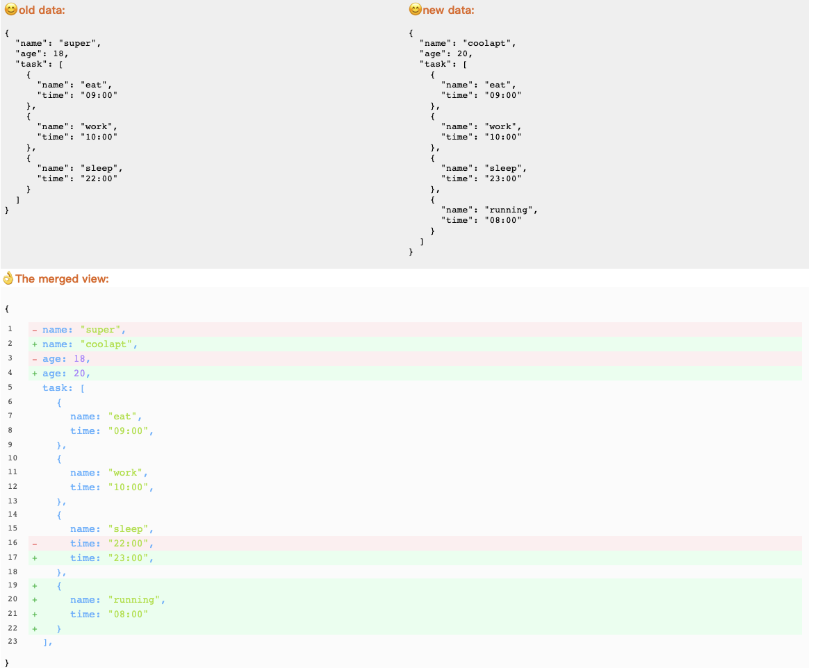

# react-json-view-compare

React json compare view plugin, supports expansion and hiding. Uses react hooks.

## live demo

- https://codesandbox.io/s/jovial-meadow-v17pw

[](https://github.com/5SSS/react-json-view-compare)

## Links

- [Github](https://github.com/5SSS/react-json-view-compare)

## Install

```js
npm install --save react-json-view-compare
```

## Usage

```jsx
import ReactJsonViewCompare from 'react-json-view-compare';

const oldData = {
  name: 'super',
  age: 18,
  task: [
    { name: 'eat', time: '09:00' },
    { name: 'work', time: '10:00' },
    { name: 'sleep', time: '22:00' }
  ]
};
const newData = {
  name: 'coolapt',
  age: 20,
  task: [
    { name: 'eat', time: '09:00' },
    { name: 'work', time: '10:00' },
    { name: 'sleep', time: '23:00' },
    { name: 'running', time: '08:00' }
  ]
};
function App() {
  return <ReactJsonViewCompare oldData={oldData} newData={newData} />;
}
ReactDOM.render(<App />, document.getElementById('root'));
```

## Example



## Props

| Attribute | Type | Default |
| --------- | ---- | ------- |
| oldData   | any  | no      |
| newData   | any  | no      |

## Events

not yet...

## PS

如果喜欢请给个星星，谢谢。
If you like, please give me a star, thank you.

如果需要帮助: QQ:1573815240 邮箱: 1573815240@qq.com
if you need help: QQ:1573815240 email: 1573815240@qq.com
